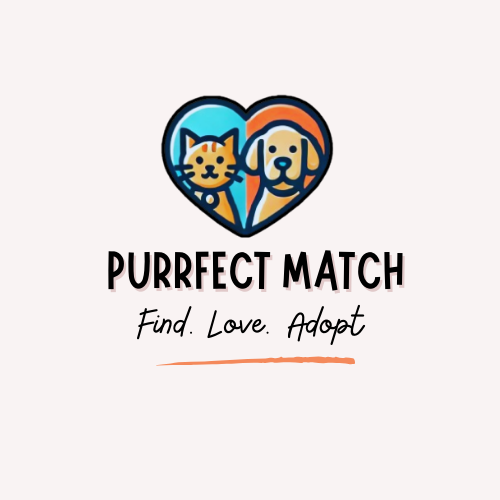

# PurrfectMatch

PurrfectMatch is a web application designed to connect pet lovers with local animal shelters. The platform makes the adoption process easier while providing useful tools for shelters to manage their animals efficiently.

## Overview

PurrfectMatch helps both users looking to adopt a pet and shelter administrators who need to manage available animals. The main features include:

- *Adoption Portal:* Search and filter available pets by species, age, location, and more.
- *Pet Care Tracker:* Set up reminders for feeding, vet visits, and other important tasks.
- *Shelter Management:* Admins can add, update, and manage pet profiles, adoption requests, and user interactions.
- *Community Hub:* Users can join forums, share pet stories, and connect with fellow pet lovers.

## User Stories

### For Users:

#### 1. Finding a Pet to Adopt
Looking for a pet should be simple and enjoyable. I want to explore different animals and find one that’s the right fit for me.

- I can browse and filter pets by type, breed, age, and location.
- Each pet profile has photos, history, and personality details.
- I can easily contact the shelter to ask questions or start the adoption process.

#### 2. Keeping Track of Pet Care
Taking care of a pet comes with responsibilities. I need a way to organize vet visits, feeding times, and other important tasks so my pet stays healthy and happy.

- I can set reminders for daily or occasional pet care activities.
- Notifications will be sent via email or in-app alerts so I don’t forget.
- A calendar lets me keep track of all upcoming tasks in one place.

### For Admins:

#### 3. Managing Shelter Animals
Keeping adoption listings up to date is essential. I need to add, update, or remove pet profiles so adopters always see accurate information.

- I can create profiles with photos, descriptions, and medical details.
- The status of a pet (available, reserved, adopted) can be updated whenever needed.
- Once a pet is adopted, I can remove or archive its profile.

#### 4. Processing Adoption Requests
Ensuring pets go to responsible homes is a priority. I need a way to manage adoption requests efficiently.

- I can see all submitted applications in one place.
- Each request can be approved or rejected based on adoption criteria.
- I can communicate directly with adopters through the platform.
- Adoption history is recorded for future reference.

## How It Works

1. *User Registration:* Create an account using email or social media login.
2. *Pet Discovery:* Browse available animals and view detailed profiles.
3. *Adoption Process:* Submit an adoption request and communicate with the shelter.
4. *Shelter Management (Admin):* Manage pet profiles and adoption requests.
5. *Community Engagement:* Participate in forums and share experiences.

This document will be updated as the project evolves.

## Team Members

- Comeagă Ana-Maria
- Popa Ruxandra-Georgiana

